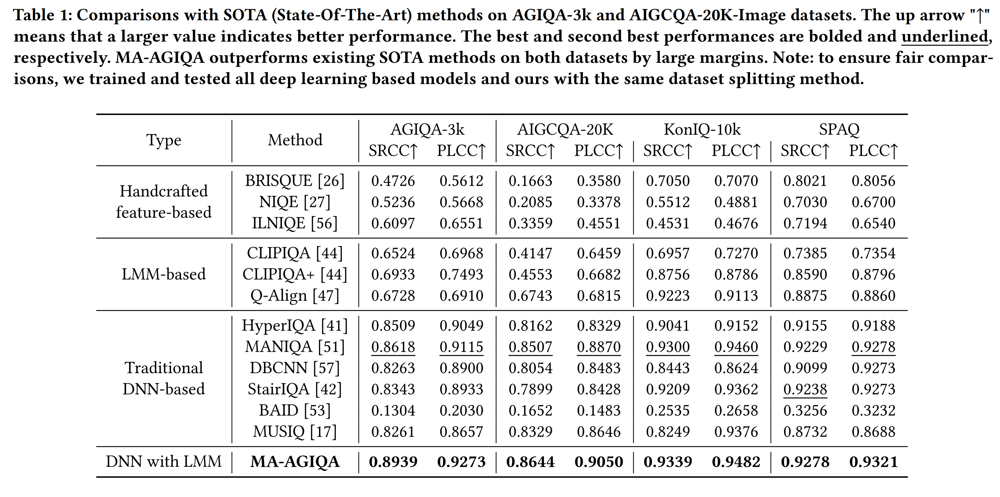

# MA-AGIQA：Large Multi-modality Model Assiste AI-Generated Image Quality Assessment
[](https://www.linux.org/)
[](https://www.python.org/)
[](https://pytorch.org/)
[](https://github.com/wangpuyi/MA-AGIQA)
[](https://arxiv.org/abs/2404.17762)


This repository is the official PyTorch implementation of [MA-AGIQA:Large Multi-modality Model Assisted AI-Generated Image Quality Assessment](https://arxiv.org/abs/2404.17762) (ACM MM'24 oral).

## Network Architecture


## Requirements 
You can use your exsiting conda environment.

If you want to create an new environment, please refer to [mPLUG-Owl2](https://github.com/X-PLUG/mPLUG-Owl/tree/main/mPLUG-Owl2#install) and follow their installation instruction.

After that, you need
```shell 
conda activate mplug_owl2
pip install omegaconf, opencv-python
```

## Usage
To use our code, firstly you should extract fine-grained semantic features. After that, you can run the train or test steps.
Here, I use AGIQA-3k as an example. You can easily change to your own datasets with slightly changes to the config files.
### Semantic Feature Extraction
We use official mPLUG-Owl2 to extract semantic features. The feature extraction codes are based on [mPLUG-Owl2](https://github.com/X-PLUG/mPLUG-Owl/tree/main/mPLUG-Owl2), great thanks to them!

You can get semantic feature by ( you should run for `question_type` 1 and 2)
```shell 
python getFeature.py --config configs/AGIQA_3k/MA_AGIQA.yaml
```
if you have error when connect to Hugging Face, we recommand you use
```shell 
HF_ENDPOINT=https://hf-mirror.com python getFeature.py --config configs/AGIQA_3k/MA_AGIQA.yaml
```
### Train and Test
Train and test procedure are integrated in the main.py file. The process will run test step when training is done. 

If you only want to run test step, please set "epoch" in yaml file to 0.
Train and Test
```shell 
python main.py --config configs/AGIQA_3k/MA_AGIQA.yaml
```
## Performance


## Model Checkpoints
You could download the checkpoints (30 epochs) through Google Drive.
- AGIQA-3k [Pre-trained](https://drive.google.com/file/d/1YT9Fryok-ozYPIvT1V3gEnEF-Ij3UxPp/view?usp=sharing)
 <!-- - AIGCQA-20k [Pre-trained](https://drive.google.com/file/d/1nKVcmBw-K9nS4tplZhMwHySpyy8ToAzK/view?usp=sharing) -->

## TODO 
- [x] release the checkpoints
- [x] simplify codes for friendly usage

## Citation
If you find our code or model useful for your research, please cite:
```
@misc{wang2024large,
      title={Large Multi-modality Model Assisted AI-Generated Image Quality Assessment}, 
      author={Puyi Wang and Wei Sun and Zicheng Zhang and Jun Jia and Yanwei Jiang and Zhichao Zhang and Xiongkuo Min and Guangtao Zhai},
      year={2024},
      eprint={2404.17762},
      archivePrefix={arXiv},
      primaryClass={cs.CV}
}
```

## Acknowledgement
Part of our codes are based on [MANIQA](https://github.com/IIGROUP/MANIQA) and [mPLUG-Owl2](https://github.com/X-PLUG/mPLUG-Owl/tree/main/mPLUG-Owl2). Thanks for their awesome work!
