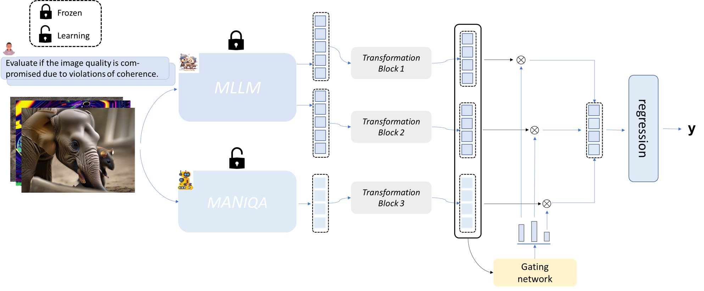
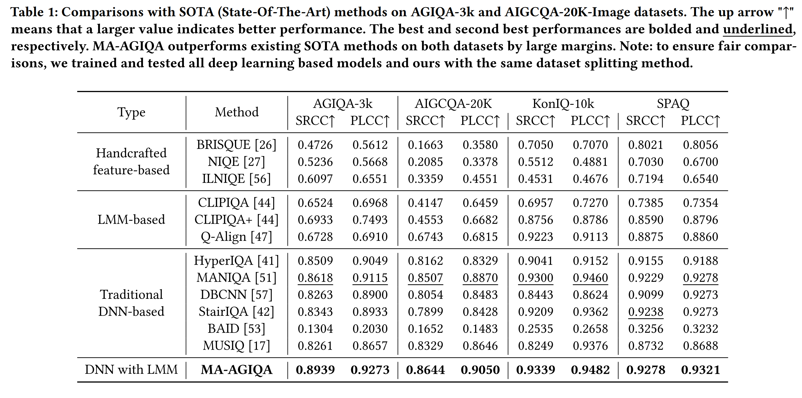

# MA-AGIQA：Large Multi-modality Model Assiste AI-Generated Image Quality Assessment
[](https://www.linux.org/)
[](https://www.python.org/)
[](https://pytorch.org/)
[](https://github.com/wangpuyi/MA-AGIQA)


## Network Architecture


## Requirements 
Our experiments are based on two conda environment. One for [Semantic Feature Extraction](#semantic-feature-extraction) and another for [Train and Test](#train-and-test).
```shell 
git clone https://github.com/Q-Future/Q-Align.git
cd Q-Align
pip install -e .
```
```shell 
git clone https://github.com/wangpuyi/MA-AGIQA.git
cd MA-AGIQA
pip install -r requirements.txt
```

## Usage
### Semantic Feature Extraction
We use official mPLUG-Owl2 to extract semantic features. The feature extraction codes are based on [Q-Align](https://github.com/Q-Future/Q-Align), great thanks to them!

First, download and transfer root to Q-Align (You should download their repository as said in [Requirements](#requirements).)
```shell 
cd Q-Align
```
then 
- put json files containing information of training data to `Q-Align/playground/data/test_jsons` like `Q-Align/playground/data/test_jsons/AGIQA_3k.json`.
- put `getFeature.py` like `Q-Align/q_align/evaluate/getFeature.py`.

You can find them under `q_align` file in this repository and get semantic feature by
```shell 
python "q_align/evaluate/getFeature.py"
```
if you have error when connect to Hugging Face, we recommand you use
```shell 
HF_ENDPOINT=https://hf-mirror.com python "q_align/evaluate/getFeature.py"
```
### Train and Test
Download and transfer root to MA-AGIQA. If you've download this repository, just implement the "cd" code.
```shell 
cd MA-AGIQA
```
Train and Test
```shell 
python train.py
```
## Performance


## TODO 
- [ ] release the checkpoints
- [ ] simplify codes for friendly usage

## Citation
If you find our code or model useful for your research, please cite:

## Acknowledgement
Part of our code are based on [MANIQA](https://github.com/IIGROUP/MANIQA) and [Q-Align](https://github.com/Q-Future/Q-Align). Thanks for their awesome work!
